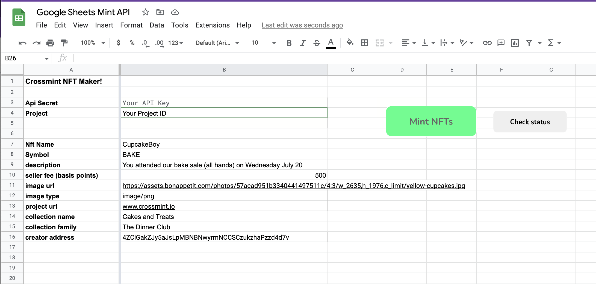

# sheets-no-code-minter

View the original Google Sheets file here:

https://docs.google.com/spreadsheets/d/1dUnkWhMnBFvxs9Zmw5nhnLA3txpzfu8EUsrYNLQ1G9k/edit#gid=0

You can copy this sheet directly and immediately start minting NFTs!

## Overview

This repo contains .gs files that you can import into the Google Appscript editor space in order to edit or change the baseline functionality as part of our existing implementation.  You can either copy the sheet directly, or create your own with the code here.

